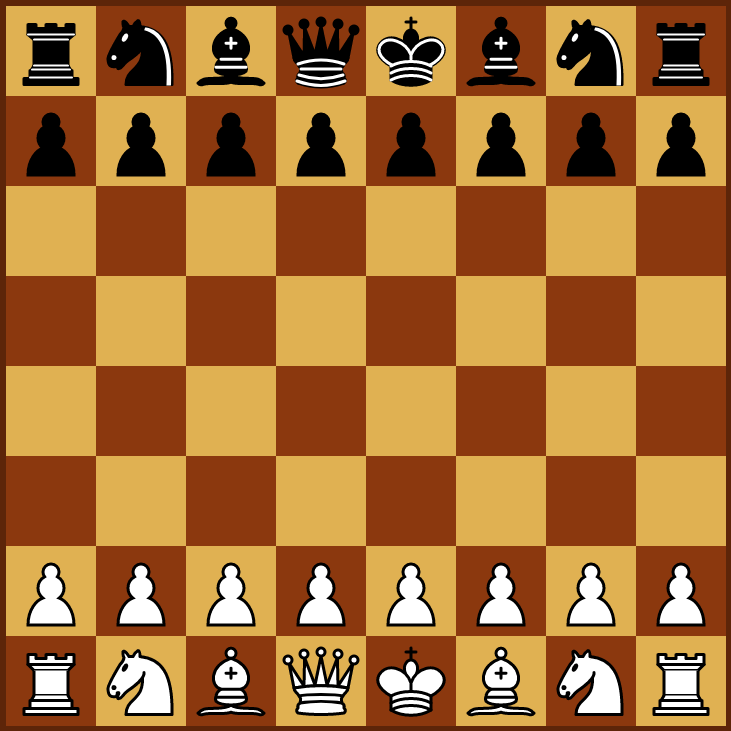

# Chessvelte

This is a multi-player chess game made with SvelteKit.

https://chessvelte.netlify.app

It uses a separately hosted express server with socket.io for the whole game logic and the communication between the players (https://chessvelte-server.onrender.com).

For a single-player version, see https://github.com/ScriptRaccoon/chessvelte-singleplayer.

